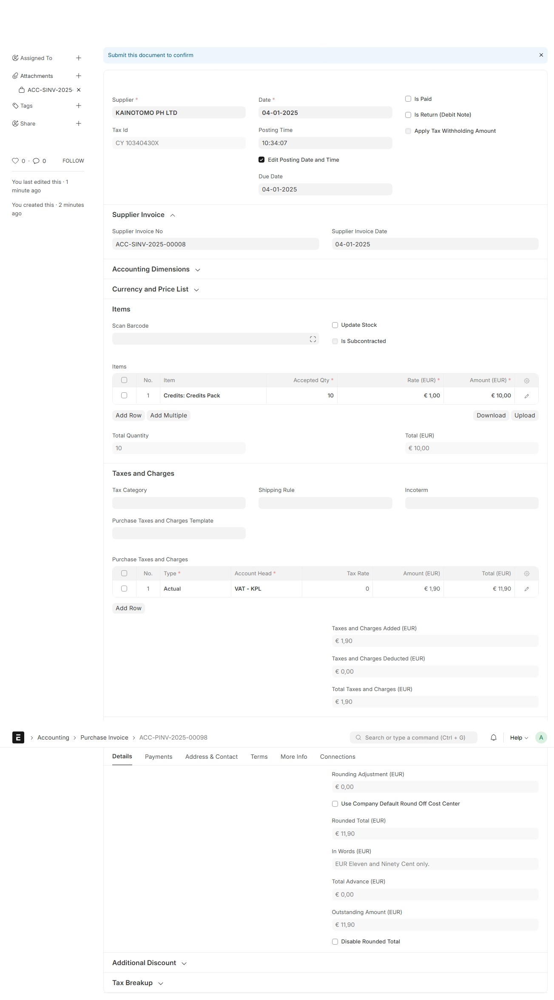

# Invoice2Erpnext User Guide

A seamless integration for automatically processing scanned invoices and creating Purchase Invoices in ERPNext.

## Overview

Invoice2Erpnext is an advanced tool that automatically processes invoices from various formats (PDF, images, etc.) and creates Purchase Invoices in ERPNext. The system extracts data from invoice documents, intelligently reconciles financial information, and creates all necessary related documents.

## Prerequisites

Before using Invoice2Erpnext, ensure:

1. You've installed the Invoice2Erpnext app in your ERPNext instance
2. Your administrator has configured the "Invoice2Erpnext Settings" with:
   - API credentials (api_key and api_secret) obtained from [https://kainotomo.com/api_keys](https://kainotomo.com/api_keys)
   - Default VAT account
   - Make sure you have credits obtained from [https://kainotomo.com/invoice2erpnext/shop](https://kainotomo.com/invoice2erpnext/shop)

### Installation

To install Invoice2Erpnext:

1. Navigate to your bench directory:
   ```
   cd /path/to/frappe-bench
   ```

2. Get the app:
   ```
   bench get-app invoice2erpnext https://github.com/kainotomo/invoice2erpnext
   ```

3. Install the app on your site:
   ```
   bench --site your-site.com install-app invoice2erpnext
   ```

4. Run migrations to update the database:
   ```
   bench --site your-site.com migrate
   ```

### Configuration

To configure Invoice2Erpnext:

1. Log in to your ERPNext site with Administrator privileges
2. Navigate to **Invoice2Erpnext Settings** in the menu
3. Configure the following required settings:
   - **API Credentials**: Enter your api_key and api_secret obtained from [https://kainotomo.com/api_keys](https://kainotomo.com/api_keys)
   - **Default VAT Account**: Select the account to be used for tax calculations

4. Save the settings

These configurations are essential for the app to function properly. Without valid API credentials, the system won't be able to process invoices.

## How to Use

### Processing Invoices

To process invoices with Invoice2Erpnext:

1. Navigate to the **Purchase Invoice** list view

2. Click the "Upload" button in the list view
3. Select the invoice files you want to process

4. The system will:
   - Process each file automatically
   - Create Purchase Invoices in draft status
   - Generate Logs with the result

Once processed, you can review and submit the created Purchase Invoices after verifying their accuracy.


## Understanding the Process

The system performs these steps automatically:

1. **Document Extraction**: Sends the invoice to KAINOTOMO server that reads text and structures
2. **Data Validation**: Checks for consistency in extracted financial data
3. **Intelligent Reconciliation**: If discrepancies exist, determines which values are most reliable based on confidence scores
4. **Return Result**: Return extracted data to your server and delete the file from KAINOTOMO server.
4. **Document Creation**:
   - Creates Supplier if not already in system
   - Creates Items if not already in system
   - Creates Purchase Invoice with line items, taxes, and totals
5. **File Attachment**: Links the original invoice file to the created Purchase Invoice

## Monitoring Results

After processing, use the Invoice2Erpnext Log to monitor status:

1. Navigate to **Invoice2Erpnext Log** in your ERPNext menu
2. View processing status for each uploaded file:
   - Status: Shows "Success" if completed successfully
   - Created Docs: Lists all documents created from the invoice
   - Message: Contains detailed processing information

The original file will be automatically attached to the new Purchase Invoice.

## Troubleshooting

If processing fails:
- Check the Invoice2Erpnext Log status and message fields
- Common issues include:
  - Poor quality scans of invoices
  - Missing critical data (vendor name, invoice date, etc.)
  - Inconsistent totals that can't be reconciled
  - Connection issues with KAINOTOMO extraction service

For best results, ensure your invoice files are clear, properly scanned, and contain all critical information.